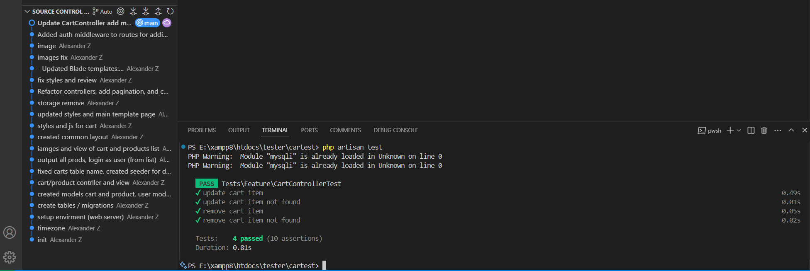

<p align="center"><a href="https://laravel.com" target="_blank"></a></p>

<p align="center">
<a href="https://github.com/laravel/framework/actions"></a>
<a href="https://packagist.org/packages/laravel/framework"></a>
<a href="https://packagist.org/packages/laravel/framework"></a>
<a href="https://packagist.org/packages/laravel/framework"></a>
</p>

# Cart Test

This is a Laravel-based e-commerce application with the following features:

## Features

### User Management
- **User List**: Displays a list of all users on the home page.
- **Login as User**: Allows to log in as any user by clicking a button next to the user's name.

### Product Management
- **Product List**: Displays a paginated list of products.
- **Pagination**: Products are displayed with pagination to improve performance and user experience.

### Cart Management
- **View Cart**: Displays the user's cart items.
- **Add to Cart**: Allows users to add products to their cart.
- **Update Cart**: Allows users to update the quantity of products in their cart.
- **Remove from Cart**: Allows users to remove products from their cart.

### Utility Routes
- **Timezone Test**: Returns the current date and time.

## Screenshots

### Home Page


### Products Page


### Cart Page


### Login as User


## Installation

1. Clone the repository:
    ```sh
    git clone https://github.com/I3rixon/cartEst.git
    cd cartEst
    ```

2. Install dependencies:
    ```sh
    composer install
    npm install
    ```

3. Copy the [.env.example](http://_vscodecontentref_/1) file to [.env](http://_vscodecontentref_/2) and configure your environment variables:
    ```sh
    cp .env.example .env
    ```

4. Generate an application key:
    ```sh
    php artisan key:generate
    ```

5. Run migrations:
    ```sh
    php artisan migrate
    ```

6. Seed the database (optional):
    ```sh
    php artisan db:seed
    ```

7. Start the development server:
    ```sh
    php artisan serve
    ```

## Usage

- Visit the home page to see the list of users.
- Navigate to the products page to see the list of products with pagination.
- Add, update, or remove products from the cart.
- Use the "Login as User" feature to log in as any user.

## License

This project is licensed under the MIT License.

## Changes
### [Unreleased] - 2023-12-20 22:15:28

- Updated web.php:
  - Added auth middleware to routes for adding, updating, and removing items from the cart.
  - Ensured only authenticated users can access these routes.

- Updated CartControllerTest:
  - Ensured the user and product exist before running tests.
  - Used withoutMiddleware to bypass CSRF token validation for testing purposes.
  - Added assertions to verify the correct response and database state.

  ## Test passed for CartController
  
